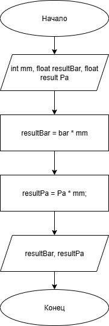

# Домашнее задание к работе 3

## Условие задачи
Написать и отладить программу пересчета мл.ртутного столба в барры и паскали.

## 1. Алгоритм и блок-схема

### Алгоритм
1. **Начало**
2. Задать константы:
   - `bar` = 0.00133322 - мм рт. ст. в бар.
   - `Pa` = 133.32 - мм рт. ст. в паскаль.
3. Задать исходные данные:
   - `mm` (int) — вводимое количество мм рт. ст.
4. Произвести вычисления:
   - `resultBar` (float) = bar * mm — итоговое значение в бар.
   - `resultPa` (float) = Pa * mm — итоговое значение в паскаль.
5. Вывести результаты расчетов с подстановкой всех значений в текст.
6. **Конец**

### Блок-схема
 

[https://github.com/glebofrl/lab2VSU/blob/master/scheme.png](https://github.com/glebofrl/lab3VSU/blob/master/scheme.png)

## 2. Реализация программы

```
#define _CRT_SECURE_NO_DEPRECATE
#define bar 0.00133322 
#define Pa 133.32
#include <stdio.h>
#include <locale.h>

void main()
{
	setlocale(LC_CTYPE, "RUS");

	int mm;
	float resultBar, resultPa;
	puts("Введите мм рт. ст:");

	scanf("%d", &mm);

	resultBar = bar * mm;
	resultPa = Pa * mm;
	printf("%d мм рт. ст – это %.3f бар\n", mm, resultBar);
	printf("%d мм рт. ст – это %.2f паскалей\n", mm, resultPa);

	system("pause");
}
```

## 3. Результаты работы программы


## 4. Информация о разработчике

Глебов Илья, бИПТ-252
